<style type="text/css">

body, td {
   font-size: 18px;
}
h1 {
  font-size: 32px;
  font-weight: bold;
}
h2 {
  font-size: 28px;
  font-weight: bold;
}
h3 {
  font-size: 24px;
  font-weight: bold;
}
h4 {
  font-size: 20px;
  font-weight: bold;
}
code.r{
  font-size: 16px;
}
pre {
  font-size: 16px
}
</style>

## 1.0 Introduction

The costs of the Affordable Care Act (ACA)'s insurance premiums seem to have risen quite a bit here in Florida. I should know: I have obtained health insurance through [Healthcare.gov](https://www.healthcare.gov/), the health insurance marketplace established by the act, from year one, which was 2014. In this notebok, I want to show how I used Microsoft's [Transact SQL](https://en.wikipedia.org/wiki/Transact-SQL) in [Microsoft SQL Server](https://en.wikipedia.org/wiki/Microsoft_SQL_Server) to extract the relevant data, and then used Microsoft's [Power BI](https://powerbi.microsoft.com/en-us/) to visualize it.

## 2.0 Getting the data

The data is from the exchange's own [website](https://data.healthcare.gov/). The data consists of several csv files, one for each year, from 2014 to 2019. I first created a new database called "Healthcare" (right-click on "Databases", select "New Database..."), then I downloaded the rates data files and imported them into SQL Server (right-click the database, select "Tasks", then "Import Flat File..." to import a csv file).

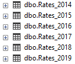
<br>

Each file has over a million records and twenty-some columns. In the interest of saving space and having the queries run faster, I only imported about half the columns from each file.

## 3.0 Running queries

### 3.1 A basic query

We can run a basic query to find out the monthly cost of the average insurance premium on a given year in the state of Florida:

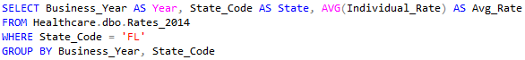
<br>

The result:

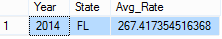
<br>

Each year's data is stored in a separate table. In order to get the average insurance premium for each year, we could write individual queries for each year, which would be repetitive, or we could somehow use another tool to "concatenate" the tables to create one huge table, then import it into SQL Server and run queries against it, but that also seems cumbersome. 

### 3.2 Using loops in Transact-SQL

A distinguishing feature of Transact SQL are [flow control statements](https://en.wikipedia.org/wiki/Transact-SQL#Flow_control): conditional execution (```IF``` and ```ELSE``` statements) and loops. We can use a [```WHILE```](https://www.essentialsql.com/build-dynamic-sql-stored-procedure/) loop to iterate over the Rates tables:

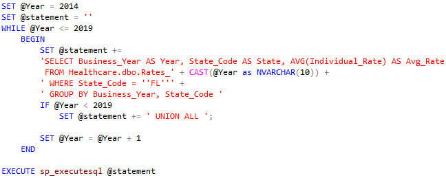
<br>

Let's unpack that query a bit. First, we have ```@Year``` as an ```int``` variable rather than a fixed value, and we are testing its value to decide whether to stay in the loop or not. We also have an ```nvarchar``` variable, ```@statement```, because we are putting the entire query in a string. The reason for that is that the name of the table we are querying changes in each loop iteration: The first query will run against ```Healthcare.dbo.Rates_2014```, the second against ```Healthcare.dbo.Rates_2015```, and so on. Also, I added ```UNION ALL``` to each query (except the last one) to output the results from all the queries in a single table.

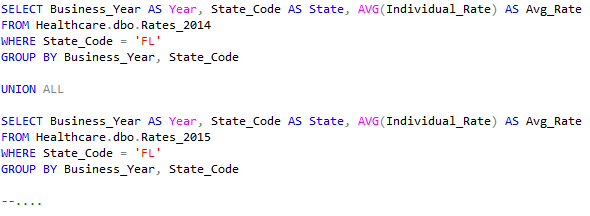
<br>

The variable ```@statement``` will have all six subqueries, 2014-2019, joined by ```UNION ALL```. By using the ```WHILE``` loop we don't have to explicitly have to write all six of them. 

Here are the results of the second query:

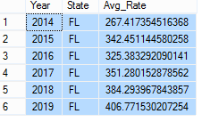
<br>

### 3.3 Using loops and table variables (arrays) in Transact-SQL

I wanted to see the insurance premiums by age. We could modify the query in 3.1 to include Age.

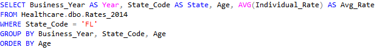
<br>

That query will give us the 2014 insurance premiums in Florida, broken down and ordered by age.

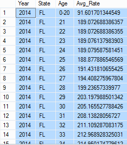
<br>

Then of course we could embed that query in a ```WHILE``` loop like we did in 3.2 to look at the premiums by age and year.

I wanted to group the results by age groups rather than by individual ages, so that there would not be so many categories and the data was more amenable to plotting. Filtering a table by age to include records between this age and that age is not straightforward because some of the Ages are not numbers, such as 'Family Option', '65 and over', '0-20', and '0-14'. Also, some of the tables have different ranges than others. In some of the tables, for example, everyone 14 years old and younger gets lumped into a '0-14' group, whereas in others, it is everyone 20 and younger. I came up with the following bins: 21-34, 35-44, 45-54, 55-63, and 64 and above.

Before we filter by Age, we need to come up with tables where 'Family Option', '0-20', and '0-14' have been removed, so we can run queries against those tables.

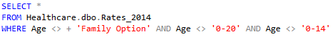
<br>

Then we can embed that table into a query that will run against it:

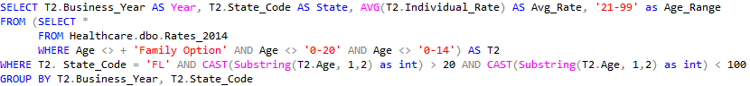
<br>

The table that resulted from the first query is renamed as 'T2', and the outer query is run against T2.

Age is an ```nvarchar``` variable, so we have to use ```CAST``` to convert it to ```int```. Also, there's an Age category called '65 and above' ('64 and above' in some tables). We are only interested in the first two characters of those strings, i.e., '64' or '65'. The code

```CAST(SUBSTRING(T2.Age, 1, 2) AS int)```

takes the first two characters of Age and casts them to an integer, so that we can run comparisons against age ranges, e.g., deciding whether Age 32 is both greater than 20 and smaller than 35. The query above returns the average premium paid by subscribers between 21 and 34 in the year 2014.

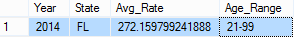
<br>

Then we can take that query, which returns the average premium in a single year for adults aged between 21 and 99 in Florida, and embed it into the earlier ```WHILE``` loop to iterate over the years.

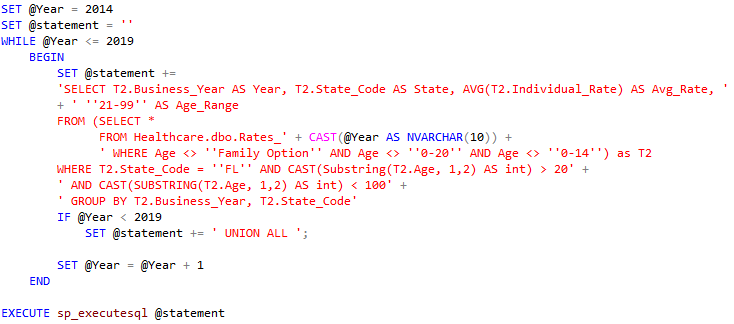
<br>

The result:

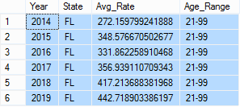
<br>

### 3.3.1 Table variables

What we want to ultimately do is to compute the average premium paid by each the age range in each year. We have already seen how to loop over the years using ```WHILE```. Now we will embed another loop into that one and set the age range in each case. In this other loop, we want to iterate over the age ranges: 21-34, 35-44, 45-54, 55-63, and 64 and above. We can create a [table variable](https://www.sqlshack.com/implement-array-like-functionality-sql-server/) and use it as a lookup table: when the loop variable is 1, read the values from the first row of the table, from the second row when the loop variable is 2, and so on. Here is the lookup table:

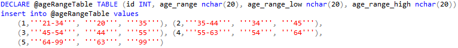
<br>

Then we can finally place the query inside the two loops, an inner one that loops over age range and an outer one that loops over the years.

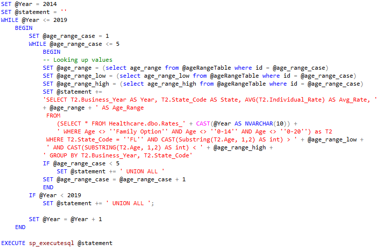
<br>

For each year, we query the ```@ageRangeTable``` lookup table and assign the resulting values to the ```@age_range``` variable, as well as the age limits to the ```@age_range_low``` and ```@age_range_high``` variables. 

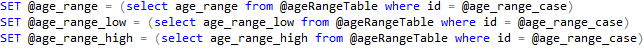
<br>

Then we substitute the age values and year values into the query, which is saved in ```@statement``` as a string. As before, we want the outputs to be concatenated, so we use ```UNION ALL``` after each loop iteration, for both loops. In the end, we have a *really* long query, which consists of 30 queries (6 years and 5 age ranges) similar to the one below, each with different values of year or/and age ranges, and each separated by a ```UNION ALL``` statement.


<br>

Here is the result:

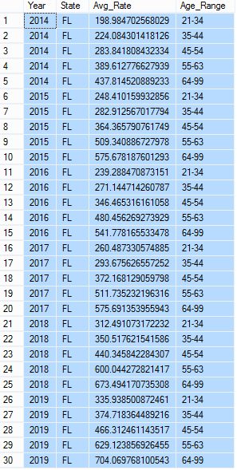
<br>

## 4.0 Visualizing the data with Power BI and R

We can save the SQL Server results as csv files and use other software to visualize the data. I took the output from the second query, the yearly average insurance premiums in Florida, imported it into [Power BI Desktop](https://powerbi.microsoft.com/en-us/), and created a barplot.

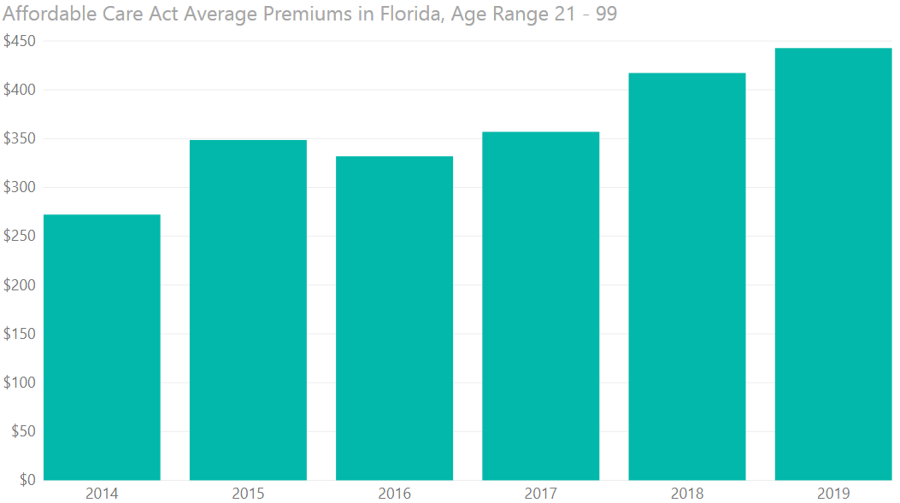
<br>

The average premium has steadily increased, with the exception of 2016, when it dipped a little. The average rate in 2019 will be \$407, a 52% increase of the \$267 average paid in 2014.

We can also plot the results of the last query we ran on SQL Server, the average insurance premiums by age group.

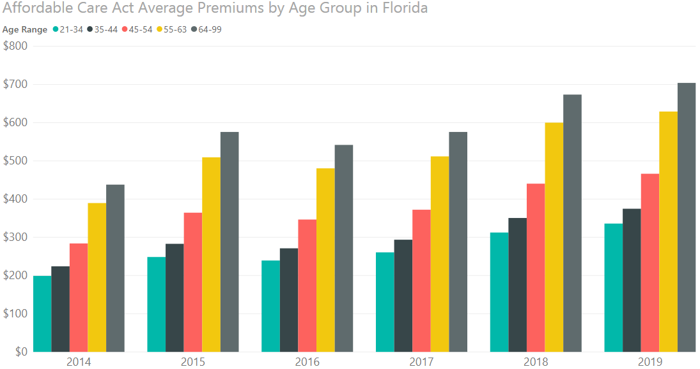
<br>

Here we notice the large difference in premiums paid by people from different age groups. On any given year, the 55-63 group pays almost twice as much for health insurance as the 21-34 does. The average elderly person pays *more* than twice as much. In addition, if a person "moved up" from one age group to the next, she can expect a huge increase in her health insurance premiums. For example, if someone was in the "45-54" bucket in 2014 and found herself in the "55-63" bucket by 2019, she can expect her premiums to increase by **120%**.

Generating those plots in Power BI did not require programming, just knowing where things are. It is not too difficult. Both of the plots are screen captures, since Power BI does not have a way to export a plot to an imge. Power BI does offer some programming capabilities, including the ability to write R code to generate plots. I wanted to find out the year-over-year (YOY) percentage change in insurance premiums. I wrote the code in the R interface provided by Power BI, which I reproduce here:

```{r, eval=FALSE, include=TRUE}
dataset <- dataset[with(dataset, order(Year)), ] # sorting by Year, ascending

premiums <- dataset$Premiums
years <- dataset$Year
years <- tail(years, length(years) -1)

# Computing the yoy % change in premiums
premiums_2014_18 <- dataset$Premiums[dataset$Year < 2019]
premiums_2015_19 <- dataset$Premiums[dataset$Year > 2014]
yoy <- (premiums_2015_19 - premiums_2014_18) / premiums_2014_18 
premiums_yoy <- data.frame(years, yoy)

# Plotting the barplot
library(ggplot2)
# Basic plot
yoy_plot <- ggplot(data = premiums_yoy) +  ggtitle("Affordable Care Act Year-Over-Year Increases in Average Premiums in Florida")
yoy_plot  <- yoy_plot  + geom_bar( aes(x = years, y= yoy), position = "dodge", stat = "identity", fill= "#02B8AB")

# Changing the look
yoy_plot + theme_bw() + theme(plot.title = element_text(size = 22, face = "bold"), axis.text = element_text(size = 20), axis.title.x = element_blank(), axis.title.y = element_blank())+ scale_y_continuous(labels = scales::percent) + expand_limits(y=c(-0.1, 0.3))


```

<br>

Here is the plot, also a screen grab:

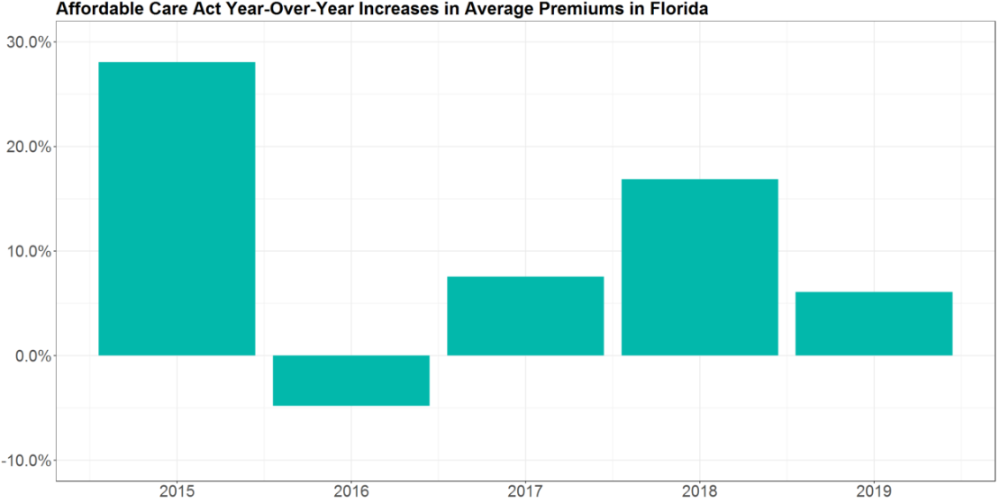
<br>

The largest increase, by far, ocurred in the second year of the ACA implementation, although 2018 saw a large increase as well.

I wanted to plot the YOY changes by age range as well. Since I would be using R again anyway, I just did it right here in this R notebook.

```{r, fig.width=10}
premiums_by_age <- read.csv("query_4_result.csv", header = FALSE)
premiums_by_age[1,1] <- 2014 # SQL Server puts a weird character in the first item

colnames(premiums_by_age) <- c("Year", "State", "Premiums", "Age_Range")

premiums <- premiums_by_age$Premiums
premiums_by_age$Year <- as.integer(as.vector(premiums_by_age$Year))

premiums_2014_18 <- premiums_by_age$Premiums[premiums_by_age$Year < 2019]
premiums_2015_19 <- premiums_by_age$Premiums[premiums_by_age$Year > 2014]
yoy <- (premiums_2015_19 - premiums_2014_18) / premiums_2014_18 
years_2015_19 <- premiums_by_age$Year[premiums_by_age$Year > 2014]
age_range_2015_19 <- premiums_by_age$Age_Range[premiums_by_age$Year > 2014]

premiums_yoy <- data.frame(years_2015_19, age_range_2015_19, yoy)

# Plotting the barplot
library(ggplot2)
# Using a color palette similar to that of Power BI for consistency
color_blind_palette <- c("#01B7AA", "#36474C", "#FC635F", "#EDC711", "#5F6D6E")
color_fill_scheme <- scale_fill_manual(values = color_blind_palette)

# Basic plot
yoy_plot <- ggplot(data = premiums_yoy) +  ggtitle("Affordable Care Act Year-Over-Year Increases in Average Premiums in Florida, by Age") + color_fill_scheme
yoy_plot  <- yoy_plot  + geom_bar( aes(x = years_2015_19, y= yoy, fill = age_range_2015_19), position = "dodge", stat = "identity")

# Formatting the plot
yoy_plot + theme_bw() + theme(plot.title = element_text(size = 16, face = "bold"), axis.text = element_text(size = 14), axis.title.x = element_blank(), axis.title.y = element_blank(), legend.position = "top", legend.title = element_blank(), legend.text = element_text(size = 14))+ scale_y_continuous(labels = scales::percent) + expand_limits(y=c(-0.1, 0.3))
```

<br>

In 2015 and 2016, the older age groups saw steeper increases in their average premiums, but in the last 3 years it has been the other way around.

## 5.0 References

1. Allix, G., Malcolm, G. [***Querying Data with Transact-SQL***](https://www.edx.org/course/querying-data-with-transact-sql-0). Winter 2018. edX.org.

2. Thompson, W. [***Analyzing and Visualizing Data with Power BI***](https://www.edx.org/course/analyzing-and-visualizing-data-with-power-bi-0). Winter 2018. edX.org.

3. Wenzel, K. [***Build Dynamic SQL in a Stored Procedure***](https://www.essentialsql.com/build-dynamic-sql-stored-procedure/)

4. Calbimonte, D. [***How to implement array-like functionality in SQL Server***](https://www.sqlshack.com/implement-array-like-functionality-sql-server/)

5. Chang, W. [***Cookbook for R***](http://www.cookbook-r.com/). Sebastopol: O'Reilly Media, 2013.

6. Christopher DuBois and Dirk Eddelbuettel. [***How to sort a dataframe by multiple column(s)?***](https://stackoverflow.com/questions/1296646/how-to-sort-a-dataframe-by-multiple-columns?rq=1).

7. STAT and luchonacho. [***How to change y axis range to percent (%) from number in barplot with R***](https://stackoverflow.com/questions/27433798/how-to-change-y-axis-range-to-percent-from-number-in-barplot-with-r).

8. tHeSiD and Jahan Zinedine. [***Append Results from two queries and output as a single table***](https://stackoverflow.com/questions/4619090/append-results-from-two-queries-and-output-as-a-single-table).
